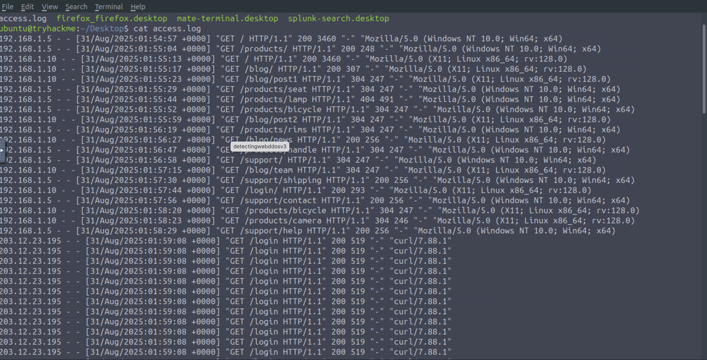
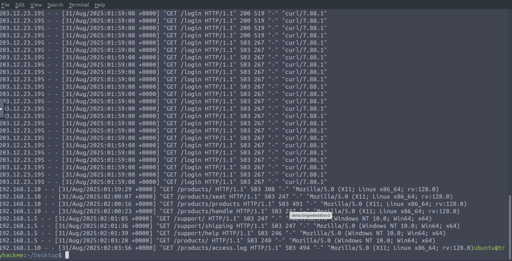
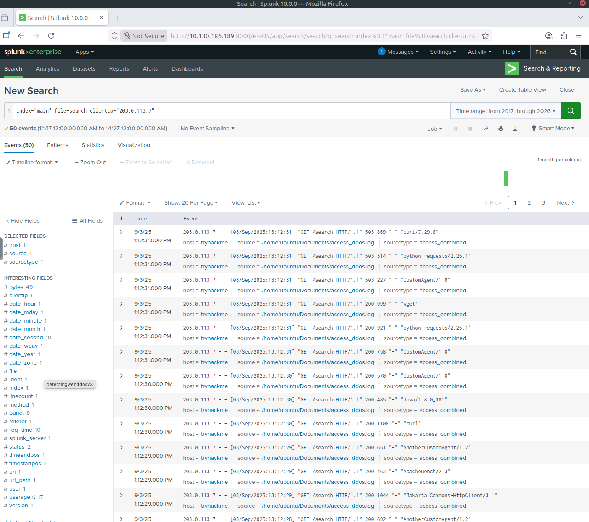
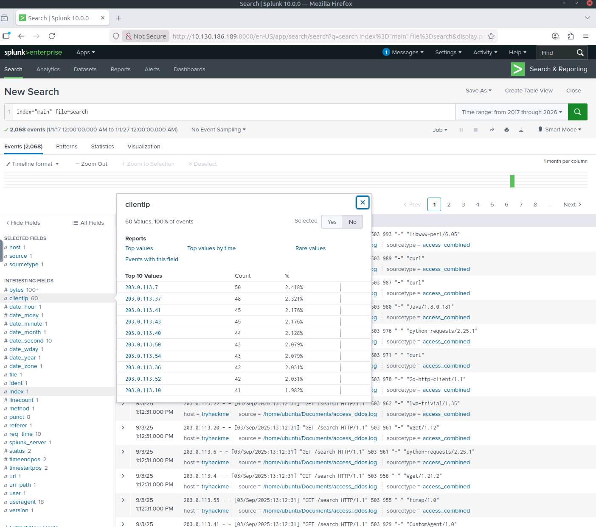
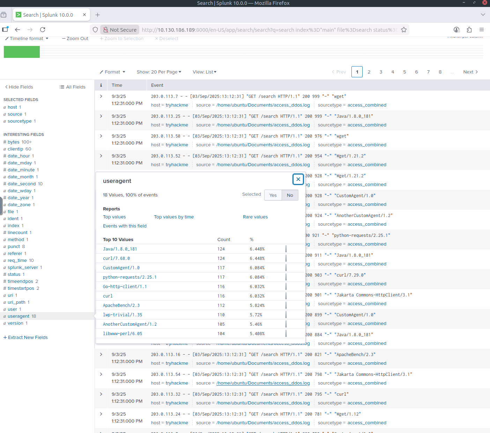
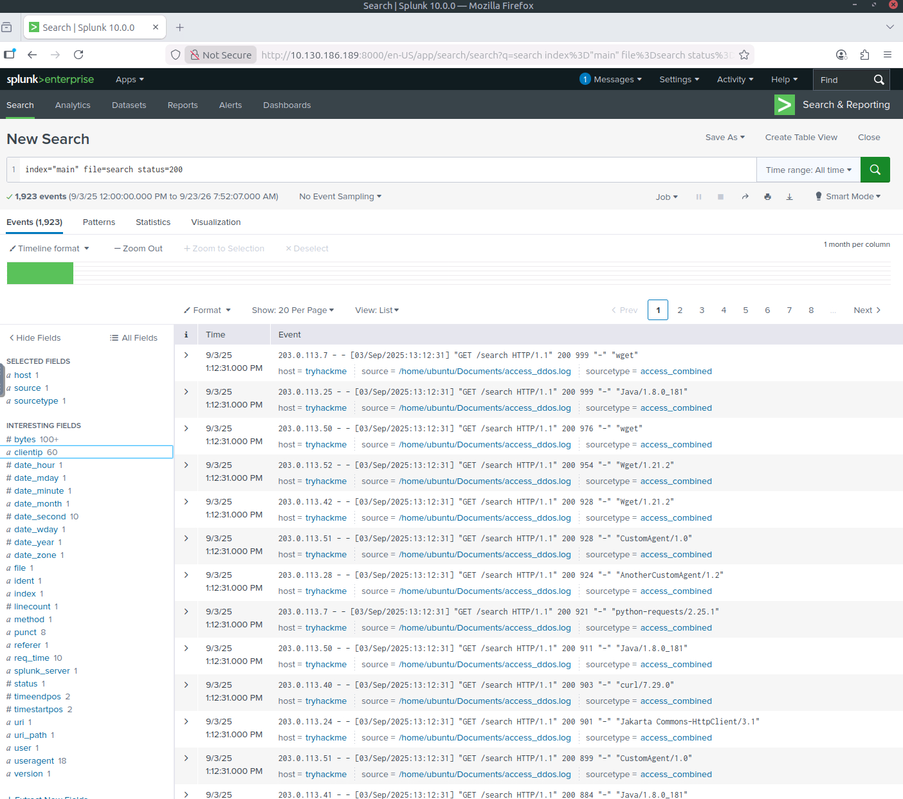
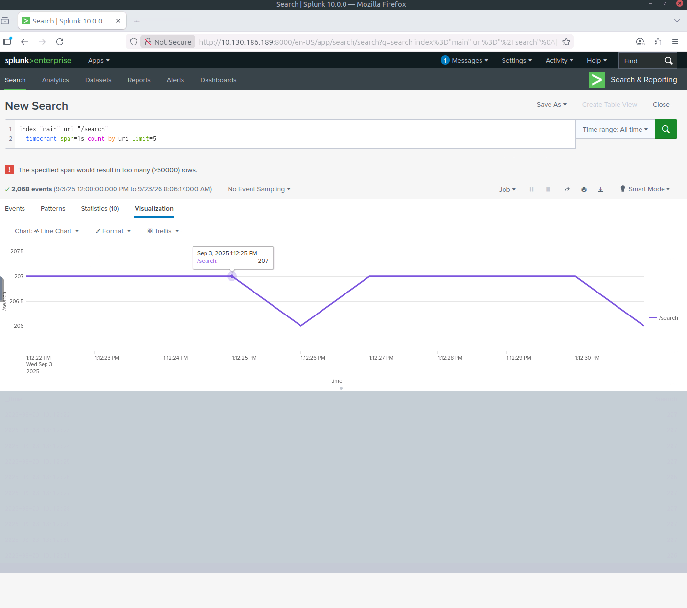
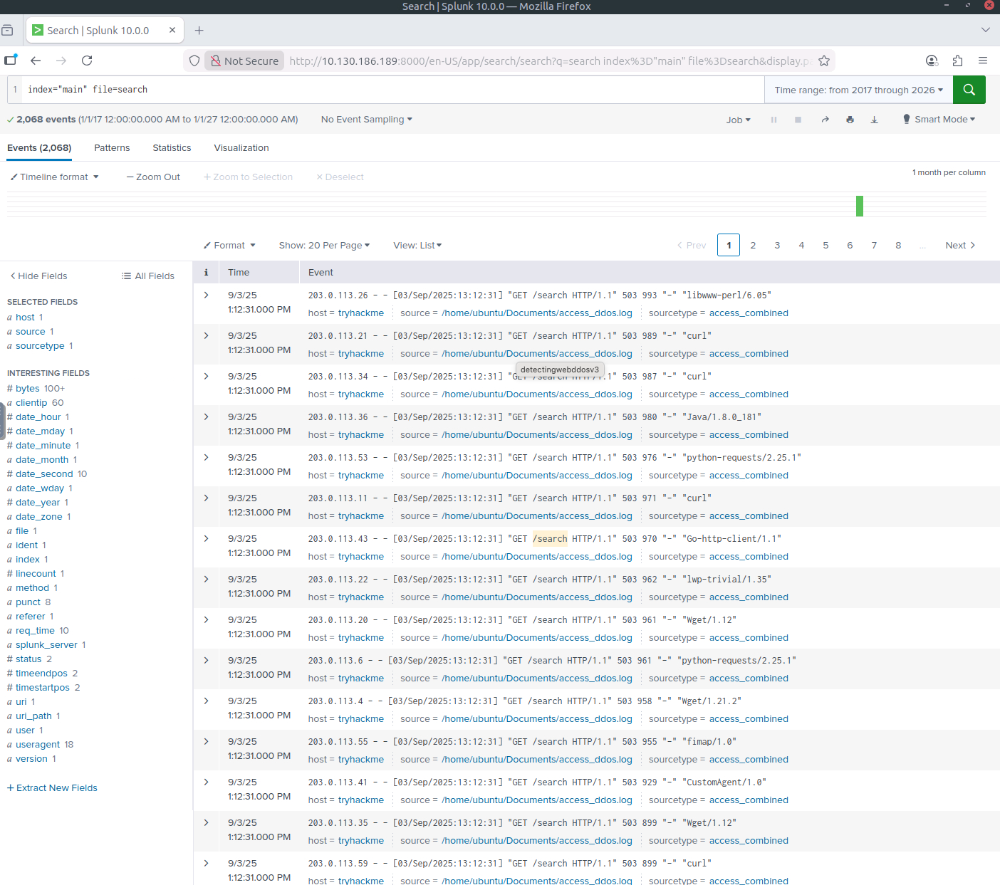

# Web DoS/DDoS Detection Lab

Detection and investigation of web DoS/DDoS activity using Linux access logs and Splunk.

## Project Overview

In this lab, I investigated suspicious web traffic using Linux access logs and Splunk. The goal was to identify abnormal request patterns, investigate suspicious client IP addresses and user agents, and determine the impact on the web service.

## Tools Used

- Linux
- Splunk
- Web/Apache access logs
- SPL (Search Processing Language)

## Investigation

### 1. Access Log Analysis

I first inspected the web server access log from the Linux terminal.

The logs showed normal user activity followed by a sudden burst of repeated requests to `/login` from:

`203.12.23.195`

The requests occurred repeatedly within the same second and used the user agent:

`curl/7.88.1`

Further inspection showed the repeated requests were initially receiving HTTP `200` responses before the server began returning HTTP `503` responses.

### 2. Client IP Investigation

I used Splunk to investigate client IP activity and identify sources generating large numbers of requests.

I also examined request counts across different client IP addresses to understand the wider traffic pattern.

### 3. User-Agent Analysis

I examined user-agent values to distinguish normal browser traffic from automated requests.

Several command-line and automated HTTP clients appeared in the logs, including:

- `curl`
- `python-requests`
- `Wget`
- `ApacheBench`

### 4. HTTP Response Analysis

I investigated HTTP status codes to understand how the server responded during the activity.

Successful HTTP `200` responses were present before service availability degraded.

### 5. Request Rate Analysis

I used Splunk time-based analysis to examine request volume and identify bursts of traffic.

### 6. Service Impact

During the suspicious traffic, HTTP `503 Service Unavailable` responses appeared. Legitimate client requests also began receiving `503` responses, indicating that the activity affected service availability.

## Key Findings

The investigation identified:

- Repeated requests targeting `/login`
- Suspicious activity associated with `203.12.23.195`
- Multiple automated HTTP user agents
- High-frequency request behaviour
- Transition from successful `200` responses to `503 Service Unavailable`
- Service disruption affecting legitimate users

These indicators are consistent with application-layer DoS-style activity in the lab dataset.

## Mitigation Recommendations

Potential defensive measures include:

- Rate limiting
- Web Application Firewall (WAF) rules
- Bot detection and filtering
- CAPTCHA or JavaScript challenges
- CDN protection
- Monitoring abnormal request rates
- Alerting on unusual increases in HTTP 5xx responses

## Skills Demonstrated

- Web access log analysis
- Splunk investigation
- SPL searching
- IP and user-agent analysis
- HTTP status-code analysis
- DoS/DDoS detection
- Incident investigation
- Security monitoring
